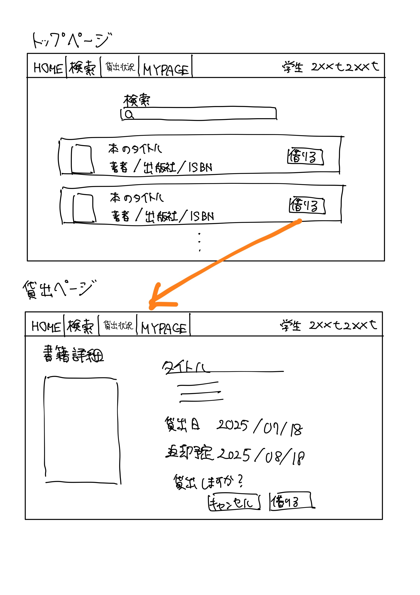
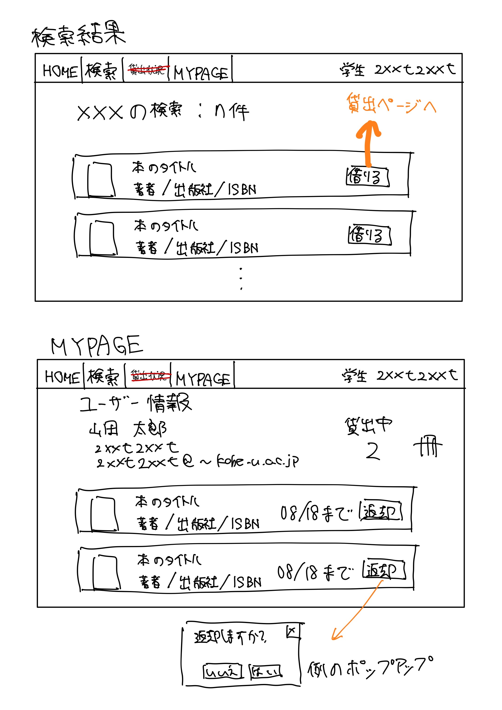

## 研究室蔵書管理システム（簡易版）のユースケース

### 学生用ユースケース
- 蔵書を貸出する
- 蔵書を返却する
- ~~貸出状況を可視化する~~
- 貸出予約を行う
- 返却期限のメール通知を行う

### 教員用ユースケース
- 同上
- 蔵書のCRUD
- ユーザーのCRUD

### ユースケース図

### ユースケースドキュメント
【ユースケース：蔵書を貸出する】
- 概要： ユーザが蔵書の貸出を行う
- アクター：ユーザ
- 事前条件：ユーザがシステムにログインしていること, 借りたい本が貸出中でないこと
- 事後条件：当該書籍の貸出が完了する
- トリガ―：ユーザが書籍の検索を行う
- 基本フロー：
    1. 学生は，トップページの検索欄に書籍の名前またはISBNを入力する
    2. システムは，クエリにマッチし，かつ貸出可能な書籍一覧を表示する
    3. 学生は，借りたい書籍の「貸出」ボタンを押下する
    4. システムは，貸出確認画面を表示する
    5. ユーザは，「借りる」ボタンを押下する
- 代替フロー1：
    - 1a-1. トップページからヘッダーメニューの「検索」のボタンを押下する
    - 1a-2. 検索画面に書籍名，ISBN，著者名などを入力し，「検索」ボタンを押下する
    - 1a-3. 以下は 2. に合流する

